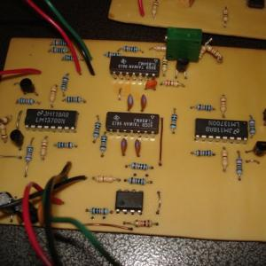
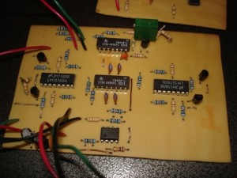

 

I agree when Ray says "This is a really good filter." Plans [here](http://www.musicfromouterspace.com/analogsynth/vcf.html) .  [<!\[CDATA\[//><!-- var \_gaq = \_gaq || \[\];\_gaq.push(\["\_setAccount", "UA-6502690-3"\]);\_gaq.push(\["\_trackPageview"\]);(function() {var ga = document.createElement("script");ga.type = "text/javascript";ga.async = true;ga.src = ("https:" == document.location.protocol ? "https://ssl" : "http://www") + ".google-analytics.com/ga.js";var s = document.getElementsByTagName("script")\[0\];s.parentNode.insertBefore(ga, s);})(); //--><!\]\]>  7 
  <!---
  

      
    

            

                            

        

 
I agree when Ray says "This is a really good filter."  Plans  <a href="http://www.musicfromouterspace.com/analogsynth/vcf.html" xmlns="http://www.w3.org/1999/xhtml">here</a> .

  

 <a href="http://www.beigerecords.com/joe/wp-content/uploads/2008/12/4plpf_front.jpg" xmlns="http://www.w3.org/1999/xhtml">&lt;img src="http://www.beigerecords.com/joe/wp-content/uploads/2008/12/4plpf_front-221x300.jpI agree when Ray says "This is a really good filter."  Plans <a href="http://www.musicfromouterspace.com/analogsynth/vcf.html">here</a>.

          
    
          
    
  
 <!-- /node -->          								
         <!-- /main-content -->

        
       <!-- /content-column -->

               <!-- /sidebar-left -->
      
               <!-- /sidebar-right -->
          
   <!-- /columns -->

    
           <!-- /footer-wraper -->
    
   <!-- /container -->

  

</a> 7
  --->