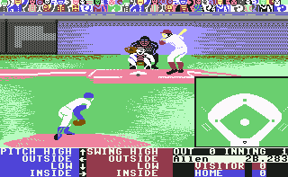

 

A series of square-stitch bracelets based on the audience graphics from the Commodore64 game Hardball the game:  finished things: [<!\[CDATA\[//><!-- var \_gaq = \_gaq || \[\];\_gaq.push(\["\_setAccount", "UA-6502690-3"\]);\_gaq.push(\["\_trackPageview"\]);(function() {var ga = document.createElement("script");ga.type = "text/javascript";ga.async = true;ga.src = ("https:" == document.location.protocol ? "https://ssl" : "http://www") + ".google-analytics.com/ga.js";var s = document.getElementsByTagName("script")\[0\];s.parentNode.insertBefore(ga, s);})(); //--><!\]\]>  5 
  <!---
  

      
    

            

                            

        

 
A series of square-stitch bracelets based on the audience graphics from the Commodore64 game Hardball

the game:
  

finished things:
 <a href="http://www.beigerecords.com/joe/wp-content/uploads/2008/11/hardball_bracelet.jpg" xmlns="http://www.w3.org/1999/xhtml">&lt;img src="http://www.beigerecords.com/joe/wp-content/uploads/2008/11/hardball_bracelet-300x43.jpg" alt=""A series of square-stitch bracelets based on the audience graphics from the Commodore64 game Hardball

the game:

finished things:

          
    
          
    
  
 <!-- /node -->          								
         <!-- /main-content -->

        
       <!-- /content-column -->

               <!-- /sidebar-left -->
      
               <!-- /sidebar-right -->
          
   <!-- /columns -->

    
           <!-- /footer-wraper -->
    
   <!-- /container -->

  

</a> 5
  --->