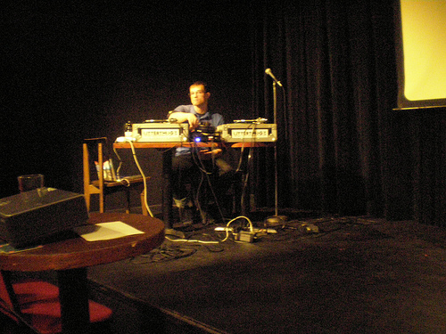
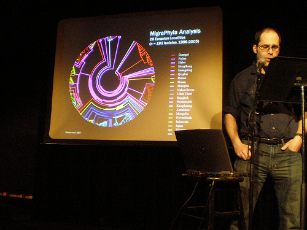

 

Robert Wallace had me select and DJ music for his presentation about Bird Flu. We ran through his talk for his geography class at the U of M the Friday before spring break and then did our fancy performance at Bryant Lake Bowl on St. Patrick's day evening for Cafe Scientifique.   [M.I.A.](http://www.youtube.com/watch?v=D6iEe_1kWqA) was an obvious choice, and Barron, Mike and Paul sent me awesome selections for the occasion. But, I have to say [the most perfect track idea](http://www.youtube.com/watch?v=L2PmmEObVLU) (and the one with the greatest crowd reaction) was from [Lauren Michele Manke](http://oakened.blogspot.com/) .

Top Five Bird Flu Tracks:

5\. M.I.A. - Bird Flu  
4\. Miami - Chicken Yellow  
3\. Mr. Scruff - Chicken in A Box  
2\. Cibo Matto - Know Your Chicken  
1\. Prince - When Doves Cry  
24 
  <!---
  

      
    

            

                            

        

 
Robert Wallace had me select and DJ music for his presentation about Bird Flu.  We ran through his talk for his geography class at the U of M the Friday before spring break and then did our fancy performance at Bryant Lake Bowl on St. Patrick's day evening for Cafe Scientifique.

  

  

 <a href="http://www.youtube.com/watch?v=D6iEe_1kWqA" xmlns="http://www.w3.org/1999/xhtml">M.I.A.</a>  was an obvious choice, and Barron, Mike and Paul sent me awesome selections for the occasion.  But, I have to say  <a href="http://www.youtube.com/watch?v=L2PmmEObVLU" xmlns="http://www.w3.org/1999/xhtml">the most perfect track idea</a>  (and the one with the greatest crowd reaction) was from  <a href="http://oakened.blogspot.com/" xmlns="http://www.w3.org/1999/xhtml">Lauren Michele Manke</a> . 

 
Top Five Bird Flu Tracks:
 
5. M.I.A. - Bird Flu   
4. Miami - Chicken Yellow   
3. Mr. Scruff - Chicken in A Box   
2. Cibo Matto - Know Your Chicken   
1. Prince - When Doves Cry   

 24
  --->