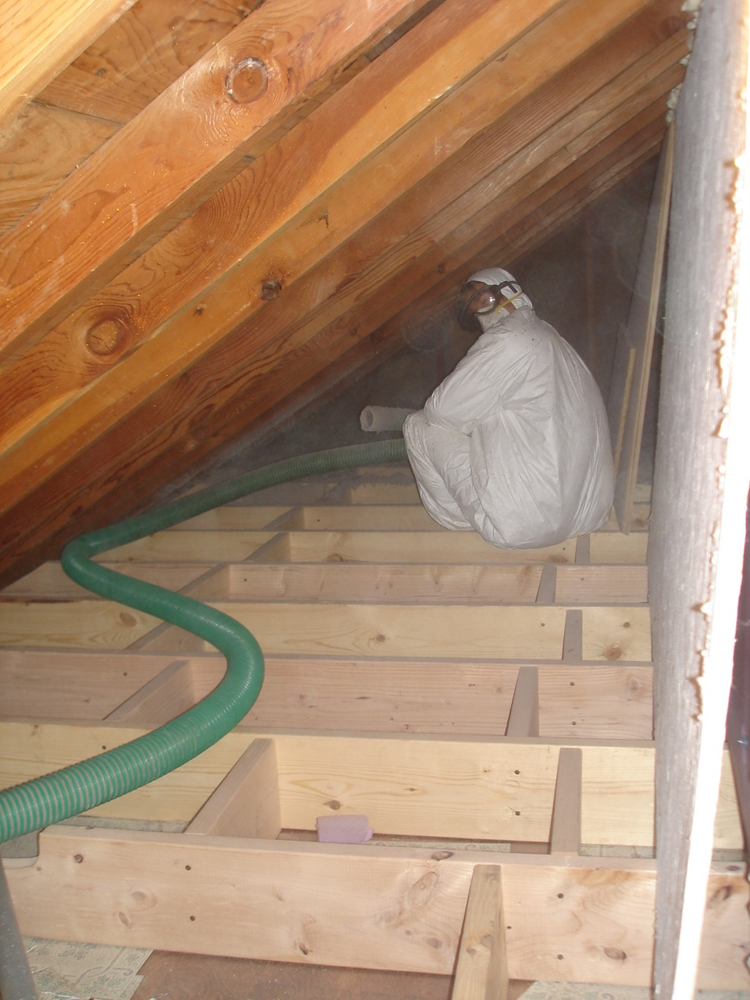

 

I raised the attic floor with a 2x8 frame and blew in cellulose insulation. Master insulation machine operator Jay Manke loaded the bales down in front. The cellulose is extremely dusty and difficult to contain. \[gallery\] 2 
  <!---
  

      
    

            

                            

        

 
I raised the attic floor with a 2x8 frame and blew in cellulose insulation. Master insulation machine operator Jay Manke loaded the bales down in front. The cellulose is extremely dusty and difficult to contain.
[gallery]  2
  --->