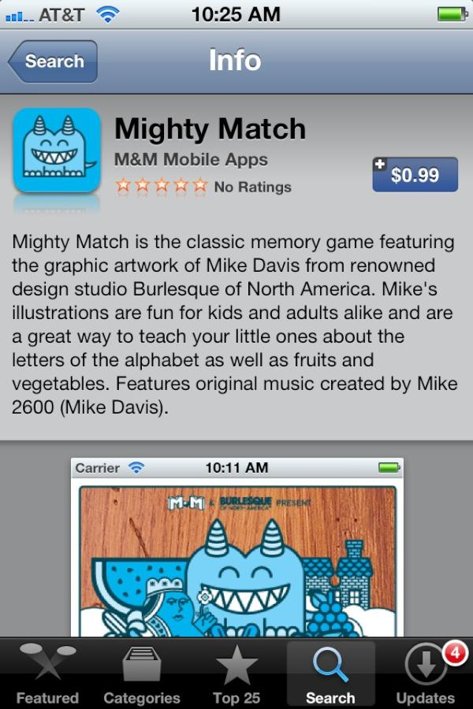

 

My good friends Mike & Mali and I have started making iOS apps. [Here is the first one](http://itunes.apple.com/us/app/mighty-match/id527010907?mt=8) - a simple matching game showing off Mike's iconic illustrations of alphabet letters and vegetables. 4 
  <!---
  

      
    

            

                            

        

 
My good friends Mike &amp; Mali and I have started making iOS apps.  <a href="http://itunes.apple.com/us/app/mighty-match/id527010907?mt=8" xmlns="http://www.w3.org/1999/xhtml">Here is the first one</a>  - a simple matching game showing off Mike's iconic illustrations of alphabet letters and vegetables. 4
  --->