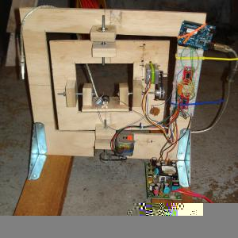
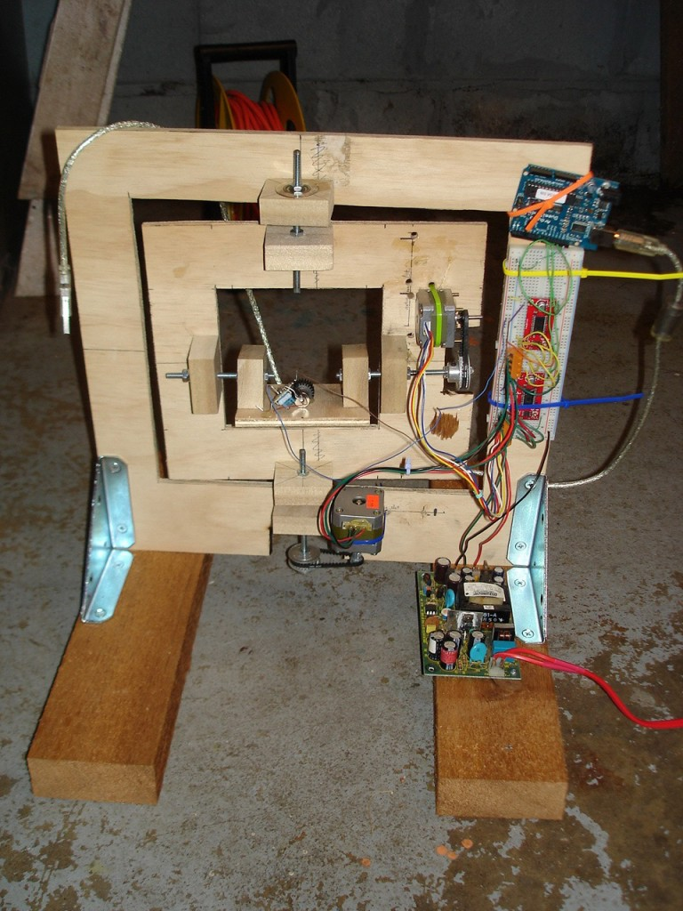
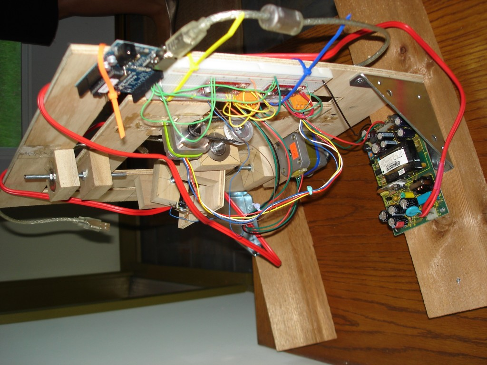
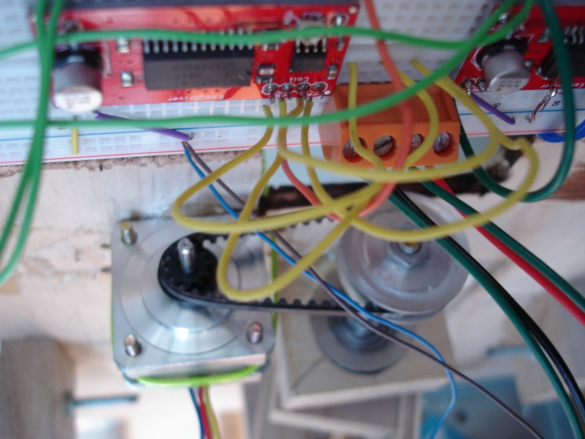
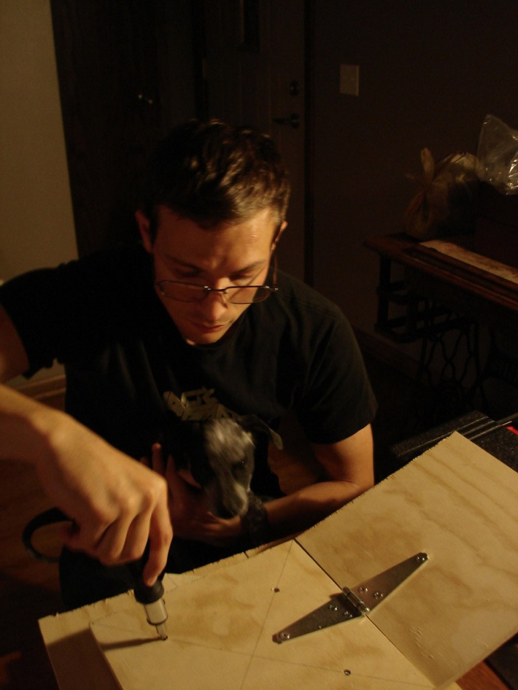

 

Here is a prototype two-axis pointing device designed to aim a laser diode's beam. It operates via USB to Arduino with my modified Firmata and AS3 Glue code and two EasyDriver stepper motor controller boards.  This design is movable over virtually the entire sphere but it's difficult to build a well-aligned bearing and gear or pulley system. And, the azimuth structure is massive enough to cause a lot of bounce when it starts/stops.  The rubber timing belts also contributed to the bounce.  Ultimately, the position was not repeatable. So, I'm working on a new prototype that will swivel on a lazy susan bearing and elevate across a sturdy hinge. The stepper motors will be joined to threaded rods which thread into t-nuts attached to the moveable parts. No play and no bounce should provide for positional repeatability.  And this time I have very good help. 10 
  <!---
  

      
    

            

                            

        

 
Here is a prototype two-axis pointing device designed to aim a laser diode's beam. It operates via USB to Arduino with my modified Firmata and AS3 Glue code and two EasyDriver stepper motor controller boards.

  

This design is movable over virtually the entire sphere but it's difficult to build a well-aligned bearing and gear or pulley system.  And, the azimuth structure is massive enough to cause a lot of bounce when it starts/stops.

  

The rubber timing belts also contributed to the bounce. 

  

Ultimately, the position was not repeatable.  So, I'm working on a new prototype that will swivel on a lazy susan bearing and elevate across a sturdy hinge.  The stepper motors will be joined to threaded rods which thread into t-nuts attached to the moveable parts.  No play and no bounce should provide for positional repeatability.

  

And this time I have very good help.

 10
  --->