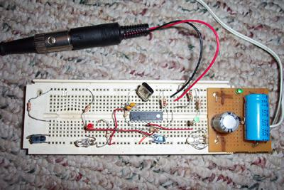
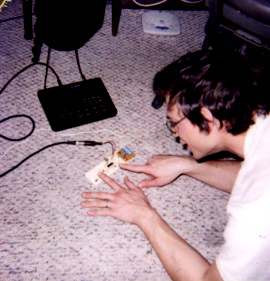

 

Since I was like 10, I wanted to make a midi drum pad with infra-red light beams to break instead of pads to hit. Now I've been working with PIC16f84 chips and realized I could do it pretty easily.

This prototype had two light-pads that sent midi successfully.

The next step will be to make one with 8 pads and build a usable model to see if that's enough or if I want to multiplex and have 16 or more pads.

8 
  <!---
  

      
    

            

                            

              

                            

        

 
 
Since I was like 10, I wanted to make a midi drum pad with infra-red light beams to break instead of pads to hit. Now I've been working with PIC16f84 chips and realized I could do it pretty easily.
 

 
This prototype had two light-pads that sent midi successfully.
 

 
The next step will be to make one with 8 pads and build a usable model to see if that's enough or if I want to multiplex and have 16 or more pads.
 

 8
  --->