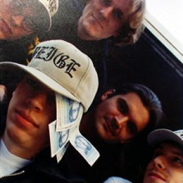
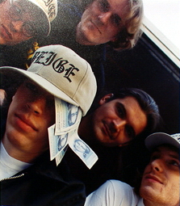

 

 Beige got to head to Munich right after 9-11 for a high-tech art show and performance.  Beige got to head to Munich right after 9-11 for a high-tech art show and performance. We love to hang out with Bodenstaendig 2000 and Olia Lialina and had a great time showing our stuff and talking smack. [Beige Interview](http://www.makeworlds.org/1/interview_beige.html) I'll never be able to thank Olia enough for putting us up a few extra days. And I'll never be able to forgive her for feeding us that much [weisswurst](http://en.wikipedia.org/wiki/Weisswurst) and then telling us it was made of brains at the height of the mad cow crisis. 10 
  <!---
  

      
    

            

                            

        

 
  
Beige got to head to Munich right after 9-11 for a high-tech art show and performance.  
Beige got to head to Munich right after 9-11 for a high-tech art show and performance.  We love to hang out with Bodenstaendig 2000 and Olia Lialina and had a great time showing our stuff and talking smack.

 <a href="http://www.makeworlds.org/1/interview_beige.html" xmlns="http://www.w3.org/1999/xhtml">Beige Interview</a> 

I'll never be able to thank Olia enough for putting us up a few extra days. And I'll never be able to forgive her for feeding us that much  <a href="http://en.wikipedia.org/wiki/Weisswurst" xmlns="http://www.w3.org/1999/xhtml">weisswurst</a>  and then telling us it was made of brains at the height of the mad cow crisis.
 10
  --->