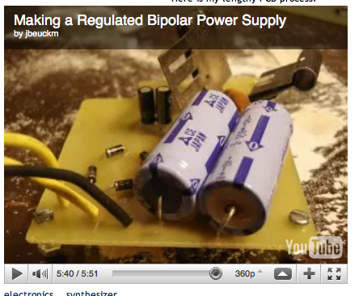

 

I've made a lot of kludged-together power supplies in my time, but they scare me. So I drew this PCB pattern, scanned it in, and it has been working well for me:  Here is my lengthy PCB process: <embed src="http://www.youtube.com/v/AlNU8zuCVqw&amp;hl=en&amp;fs=1" type="application/x-shockwave-flash" allowscriptaccess="always" allowfullscreen="true" width="425" height="344"> 5 
  <!---
  

      
    

            

                            

        

 
I've made a lot of kludged-together power supplies in my time, but they scare me.  So I drew this PCB pattern, scanned it in, and it has been working well for me:

  

Here is my lengthy PCB process: 

 <object width="425" height="344" xmlns="http://www.w3.org/1999/xhtml"><param name="movie" value="http://www.youtube.com/v/AlNU8zuCVqw&amp;hl=en&amp;fs=1"></param><param name="allowFullScreen" value="true"></param><param name="allowscriptaccess" value="always"></param><embed src="http://www.youtube.com/v/AlNU8zuCVqw&amp;hl=en&amp;fs=1" type="application/x-shockwave-flash" allowscriptaccess="always" allowfullscreen="true" width="425" height="344"></embed></object> 5
  --->