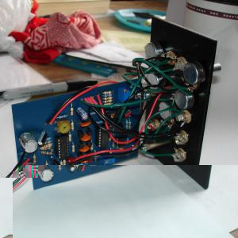
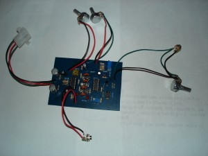
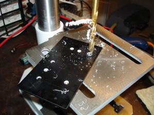
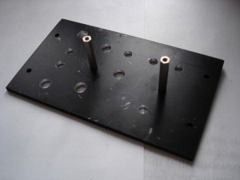
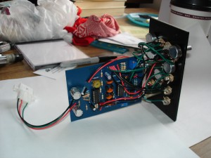

 

This is a pretty classy Moog style VCF I found plans for [here](http://yusynth.net/Modular/EN/MOOGVCF/index.html) . I got help troubleshooting my construction from the nice people on the forums at [electro-music.com](http://electro-music.com/) , including Yves Usson himself.    

<audio controls="controls" preload="auto" autobuffer="autobuffer" xmlns="http://www.w3.org/1999/xhtml"><source src="minimoog_sample.mp3"></audio>

16 
  <!---
  

      
    

            

                            

        

 
This is a pretty classy Moog style VCF I found plans for  <a href="http://yusynth.net/Modular/EN/MOOGVCF/index.html" xmlns="http://www.w3.org/1999/xhtml">here</a> .  I got help troubleshooting my construction from the nice people on the forums at  <a href="http://electro-music.com/" xmlns="http://www.w3.org/1999/xhtml">electro-music.com</a> , including Yves Usson himself.

  

  

  

  

 <audio controls="controls" preload="auto" autobuffer="autobuffer" xmlns="http://www.w3.org/1999/xhtml"> 
  <source src="/joe/wp-content/uploads/2008/12/minimoog_sample.mp3"></source>
</audio> 

 16
  --->