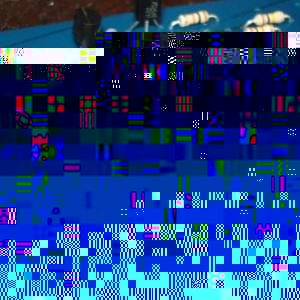
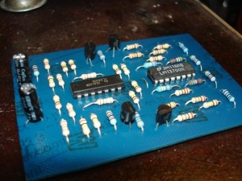

 

Just finished a new dual VCA as described [here](http://www.musicfromouterspace.com/analogsynth/newdualvca.html) . I had the board sitting around half done all summer.  The worst haphazard panel layout I have done yet. [<source src="ringmod_sine_sample.mp3"></audio>

<!--//--><!\[CDATA\[//><!-- var \_gaq = \_gaq || \[\];\_gaq.push(\["\_setAccount", "UA-6502690-3"\]);\_gaq.push(\["\_trackPageview"\]);(function() {var ga = document.createElement("script");ga.type = "text/javascript";ga.async = true;ga.src = ("https:" == document.location.protocol ? "https://ssl" : "http://www") + ".google-analytics.com/ga.js";var s = document.getElementsByTagName("script")\[0\];s.parentNode.insertBefore(ga, s);})(); //--><!\]\]> 7 
  <!---
  

      
    

            

                            

        

 
Just finished a new dual VCA as described  <a href="http://www.musicfromouterspace.com/analogsynth/newdualvca.html" xmlns="http://www.w3.org/1999/xhtml">here</a> .

I had the board sitting around half done all summer.
  

The worst haphazard panel layout I have done yet.
 <a href="http://www.beigerecords.com/joe/wp-content/uploads/2008/12/vca_front.jpg" xmlns="http://www.w3.org/1999/xhtml">&lt;img sJust finished a new dual VCA as described <a href="http://www.musicfromouterspace.com/analogsynth/newdualvca.html">here</a>.

I had the board sitting around half done all summer.

The worst haphazard panel layout I have done yet.

There was one broken trace I had to fix and now both VCA's work great linear and logarithmic.

Controlling the amplitude of one sine with another (ring modulating):

<audio controls="controls" preload="auto" autobuffer="autobuffer">
   <source src="/joe/wp-content/uploads/2008/12/ringmod_sine_sample.mp3"></source>
</audio>

          
    
          
    
  
 <!-- /node -->          								
         <!-- /main-content -->

        
       <!-- /content-column -->

               <!-- /sidebar-left -->
      
               <!-- /sidebar-right -->
          
   <!-- /columns -->

    
           <!-- /footer-wraper -->
    
   <!-- /container -->

  

</a> 7
  --->