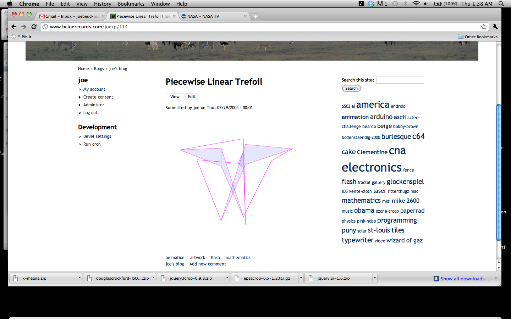

 

swfobject.embedSWF("/joe/wp-content/uploads/2008/11/trefoil1.swf", "plt", "400", "400", "9.0.0");

(needs flash)

6 
  <!---
  

      
    

            

                            

        

 
  
 
(needs flash)
 

 6
  --->