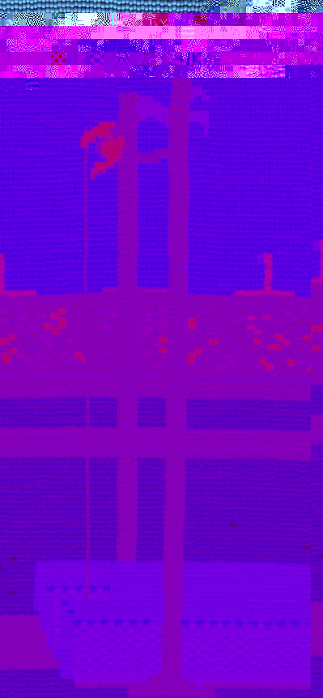

 

from Summer Games on C=64  from Summer Games on C=64  5 
  <!---
  

      
    

            

                            

        

 
from Summer Games on C=64
  from Summer Games on C=64
  5
  --->