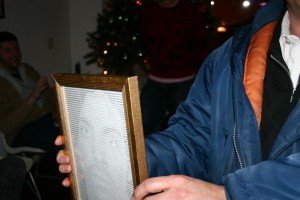

 

Click [here](prince.php) to see the plan be re-created live by my web server running a PHP program. Here is what came off of my typewriter for Will this secret santa day at Puny:  5 
  <!---
  

      
    

            

                            

        

 
Click  <a href="http://beigerecords.com/joe/textfill/prince/prince.php" xmlns="http://www.w3.org/1999/xhtml">here</a>  to see the plan be re-created live by my web server running a PHP program.

Here is what came off of my typewriter for Will this secret santa day at Puny:

  5
  --->