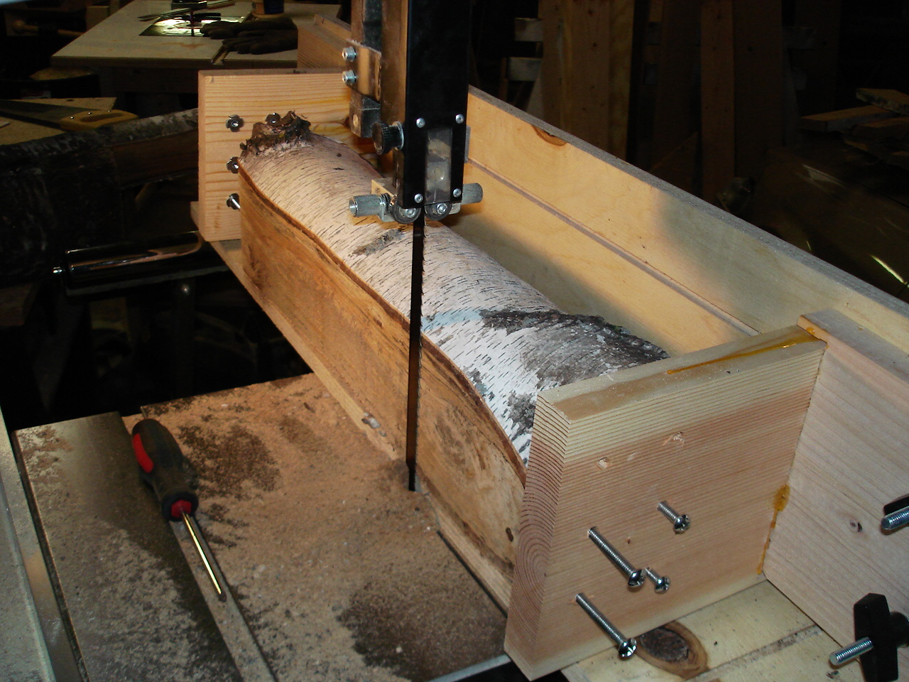

 

I finally got around to building a log sled - one of the main reasons for having a bandsaw. [<!\[CDATA\[//><!-- var \_gaq = \_gaq || \[\];\_gaq.push(\["\_setAccount", "UA-6502690-3"\]);\_gaq.push(\["\_trackPageview"\]);(function() {var ga = document.createElement("script");ga.type = "text/javascript";ga.async = true;ga.src = ("https:" == document.location.protocol ? "https://ssl" : "http://www") + ".google-analytics.com/ga.js";var s = document.getElementsByTagName("script")\[0\];s.parentNode.insertBefore(ga, s);})(); //--><!\]\]>  3 
  <!---
  

      
    

            

                            

        

 
I finally got around to building a log sled - one of the main reasons for having a bandsaw.

 <a href="http://www.beigerecords.com/joe/wp-content/uploads/2011/05/dsc040711.jpg" xmlns="http://www.w3.org/1999/xhtml">&lt;img src="http://www.beigerecords.com/joe/wp-content/uploads/2011/05/dsc040711-300x225.jpg" alt="Log sled allows me to firmly hold the log in position and slide straight along the mitre gauge slot." title="dsc040711" width="300" height="225" class=I finally got around to building a log sled - one of the main reasons for having a bandsaw.

The body of the sled is 3/4" plywood with a few t-tracks routed in to allow the fence and clamps to be easily adjusted. I ground the holder bolts to a point and they hold large logs steady after a few turns into the green wood. A strip of oak glued onto the bottom rides easily in the mitre gauge slot on the bandsaw table.

          
    
          
    
  
 <!-- /node -->          								
         <!-- /main-content -->

        
       <!-- /content-column -->

               <!-- /sidebar-left -->
      
               <!-- /sidebar-right -->
          
   <!-- /columns -->

    
           <!-- /footer-wraper -->
    
   <!-- /container -->

  

</a> 3
  --->