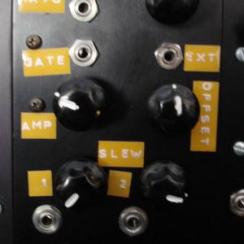
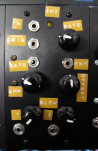

 

Really nice sample-and-hold as described [here](http://www.musicfromouterspace.com/analogsynth/NewAugustNewSampleHold.html). Internal or external clock, gate/trigger outputs, amplitude and offset settings for the CV and two outputs with individual glide controls.

Obligatory white noise input patch:

<audio controls="controls" preload="auto" autobuffer="autobuffer" xmlns="http://www.w3.org/1999/xhtml"><source src="sh2_noise_demo.mp3"></audio>

10 
  <!---
  

      
    

            

                            

        

 
 
Really nice sample-and-hold as described <a href="http://www.musicfromouterspace.com/analogsynth/NewAugustNewSampleHold.html">here</a>.  Internal or external clock, gate/trigger outputs, amplitude and offset settings for the CV and two outputs with individual glide controls.
 

  

 
Obligatory white noise input patch:
 

 <audio controls="controls" preload="auto" autobuffer="autobuffer" xmlns="http://www.w3.org/1999/xhtml"> 
  <source src="/joe/wp-content/uploads/2008/12/sh2_noise_demo.mp3"></source>
</audio> 

 10
  --->