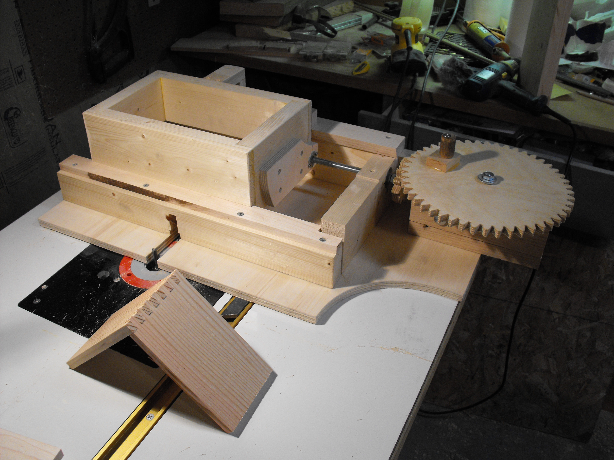

 

 I copied the design for this box joint jig from the great [http://woodgears.ca/](http://woodgears.ca/) . [           <!--//--><!\[CDATA\[//><!-- var \_gaq = \_gaq || \[\];\_gaq.push(\["\_setAccount", "UA-6502690-3"\]);\_gaq.push(\["\_trackPageview"\]);(function() {var ga = document.createElement("script");ga.type = "text/javascript";ga.async = true;ga.src = ("https:" == document.location.protocol ? "https://ssl" : "http://www") + ".google-analytics.com/ga.js";var s = document.getElementsByTagName("script")\[0\];s.parentNode.insertBefore(ga, s);})(); //--><!\]\]>  7 
  <!---
  

      
    

            

                            

        

 
  

I copied the design for this box joint jig from the great  <a href="http://woodgears.ca/" xmlns="http://www.w3.org/1999/xhtml">http://woodgears.ca/</a> .

 <a href="http://www.beigerecords.com/joe/wp-content/uploads/2010/11/dscf1114.jpg" xmlns="http://www.w3.org/1999/xhtml">&lt;img src="http://www.beigerecords.com/joe/wp-content/uploads/2010/11/dscf1114-300x225.jpg" alt="dscf1114" title="dscf

I copied the design for this box joint jig from the great <a href="http://woodgears.ca/">http://woodgears.ca/</a>.

The carriage and rails use maple for the sliding parts. No oil necessary.

I tried a few joints before building the spring-wheel assembly, which is itself box-jointed. My carriage only had a little play with no spring but I decided the spring is necessary to keep things aligned.

This is the first gear-drive I've tried to make and turned out to work pretty well.

<object width="640" height="385"><param name="movie" value="http://www.youtube.com/v/BKYGnkroXPQ?fs=1&amp;hl=en_US"></param><param name="allowFullScreen" value="true"></param><param name="allowscriptaccess" value="always"></param><embed src="http://www.youtube.com/v/BKYGnkroXPQ?fs=1&amp;hl=en_US" type="application/x-shockwave-flash" allowscriptaccess="always" allowfullscreen="true" width="640" height="385"></embed></object>

          
    
          
    
  
 <!-- /node -->          								
         <!-- /main-content -->

        
       <!-- /content-column -->

               <!-- /sidebar-left -->
      
               <!-- /sidebar-right -->
          
   <!-- /columns -->

    
           <!-- /footer-wraper -->
    
   <!-- /container -->

  

</a> 7
  --->