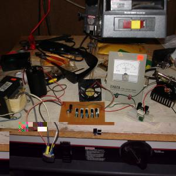
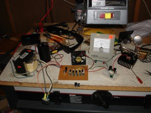

 

Left to Right:
--------------

*   Monster transformer from Mexico
*   Monster capacitor from Japan
*   Monster rectifier
*   High current 12V power supply ([schematic](http://www.elecfree.com/circuit/power-supply/12-volt-30-amp-by-7812/))
*   Classroom style ammeter (YES, 2.3AMPS!!!)
*   Constant-current driver circuit ([schematic](http://www.repairfaq.org/sam/laserdps.htm#dpsccs))
*   2W laser diode w/TEC on a big heatsink
Below that diode: **The faint red glow of 808nm love**

### Notes:

*   The thicker pair of wires on the transformer are the output - not mains. I found this out by tripping the circuit breaker a couple times. It's so nice having a house!
*   Plugging this thing in caused a spark in the mains connection, which failed after a few seconds making me fear the worst for the laser. Turns out my soldering iron is not hot enough to bond to the heavy steel connectors so I hit them with a hammer to make them touch the cables. Works great.
*   This is the first circuit I've built where the fan really is necessary. The far transistor on the power supply tends to heat up and lose current without the fan.
*   This nice diode has a TEC right in the case, so I am just running that series with the diode from the driver circuit.

Big shouts going out to [ABC Electronics](http://www.abcelectronicsmn.com/), [Ax-Man](http://ax-man.com/) and especially [heruursciences](http://laserpointerforums.com/f55/red-808nm-1-5-watt-laser-diodes-more-cheap-39834.html).

Next up: 7WATTS.

<audio controls="controls" preload="auto" autobuffer="autobuffer" xmlns="http://www.w3.org/1999/xhtml"><source src="14-whats-on-your-mind-pure-energy.mp3"></audio>

36 
  <!---
  

      
    

            

                            

        

 
  

 <h2 xmlns="http://www.w3.org/1999/xhtml">Left to Right:</h2> 
 <li xmlns="http://www.w3.org/1999/xhtml">Monster transformer from Mexico</li> 
 <li xmlns="http://www.w3.org/1999/xhtml">Monster capacitor from Japan</li> 
 <li xmlns="http://www.w3.org/1999/xhtml">Monster rectifier</li> 
 <li xmlns="http://www.w3.org/1999/xhtml">High current 12V power supply (<a href="http://www.elecfree.com/circuit/power-supply/12-volt-30-amp-by-7812/">schematic</a>)</li> 
 <li xmlns="http://www.w3.org/1999/xhtml">Classroom style ammeter (YES, 2.3AMPS!!!)</li> 
 <li xmlns="http://www.w3.org/1999/xhtml">Constant-current driver circuit (<a href="http://www.repairfaq.org/sam/laserdps.htm#dpsccs">schematic</a>)</li> 
 <li xmlns="http://www.w3.org/1999/xhtml">2W laser diode w/TEC on a big heatsink</li> 

Below that diode:  <b xmlns="http://www.w3.org/1999/xhtml">The faint red glow of 808nm love</b> 

 <h3 xmlns="http://www.w3.org/1999/xhtml">Notes:</h3> 

 <li xmlns="http://www.w3.org/1999/xhtml">The thicker pair of wires on the transformer are the output - not mains.  I found this out by tripping the circuit breaker a couple times.  It's so nice having a house!</li> 

 <li xmlns="http://www.w3.org/1999/xhtml">Plugging this thing in caused a spark in the mains connection, which failed after a few seconds making me fear the worst for the laser.  Turns out my soldering iron is not hot enough to bond to the heavy steel connectors so I hit them with a hammer to make them touch the cables. Works great.</li> 

 <li xmlns="http://www.w3.org/1999/xhtml">This is the first circuit I've built where the fan really is necessary.  The far transistor on the power supply tends to heat up and lose current without the fan. </li> 

 <li xmlns="http://www.w3.org/1999/xhtml">This nice diode has a TEC right in the case, so I am just running that series with the diode from the driver circuit.</li> 

 
Big shouts going out to <a href="http://www.abcelectronicsmn.com/">ABC Electronics</a>, <a href="http://ax-man.com/">Ax-Man</a> and especially <a href="http://laserpointerforums.com/f55/red-808nm-1-5-watt-laser-diodes-more-cheap-39834.html">heruursciences</a>.
 

Next up: 7WATTS.
 <audio controls="controls" preload="auto" autobuffer="autobuffer" xmlns="http://www.w3.org/1999/xhtml">
   <source src="/joe/wp-content/uploads/2009/08/14-whats-on-your-mind-pure-energy.mp3"></source>
</audio> 

 36
  --->