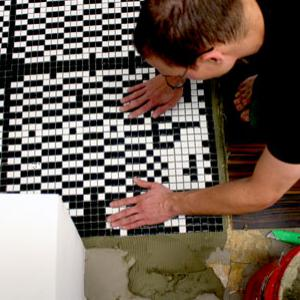
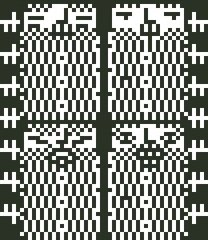
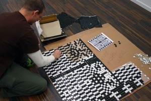
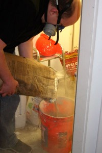
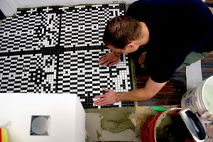

 

I've been excited about this day for months! After the new gallery floor went in at Pink Hobo, we decided to tile the little space between the door and where the level floor starts. Mitch Loidolt made this awesome and appropriate AND bearded design:  I've been interested in tactile representations of computer (pixel) art for a long time and offered to do the arranging and tiling of Mitch's intricate design. This meant hours of arranging the tiles and gluing them into their places on the backing weave, so that we could lay in 15x15 squares of pre-arranged tiles while the adhesive was wet.  With arrangement all ready and three days left until our first party(!), it was time to lay in the beardoes with Shad:   10 
  <!---
  

      
    

            

                            

        

 
I've been excited about this day for months!

After the new gallery floor went in at Pink Hobo, we decided to tile the little space between the door and where the level floor starts. Mitch Loidolt made this awesome and appropriate AND bearded design:

  

I've been interested in tactile representations of computer (pixel) art for a long time and offered to do the arranging and tiling of Mitch's intricate design.  This meant hours of arranging the tiles and gluing them into their places on the backing weave, so that we could lay in 15x15 squares of pre-arranged tiles while the adhesive was wet.

  

With arrangement all ready and three days left until our first party(!), it was time to lay in the beardoes with Shad:

  

  

 10
  --->