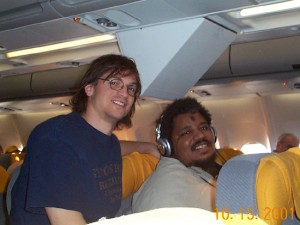

 

I met Wes on the plane to Munich.  I met Wes on the plane to Munich.  5 
  <!---
  

      
    

            

                            

        

 
I met Wes on the plane to Munich.
  I met Wes on the plane to Munich.
  5
  --->