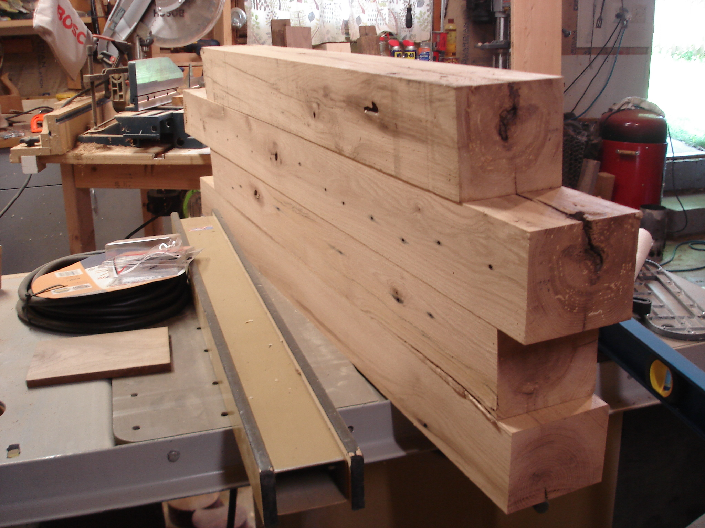
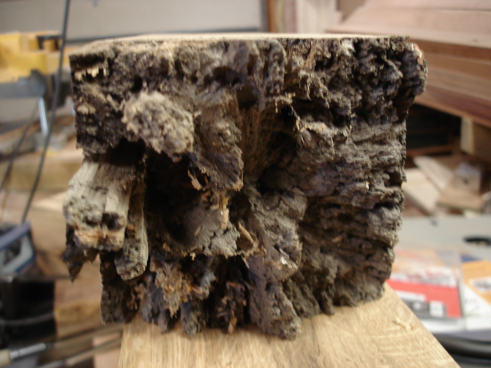
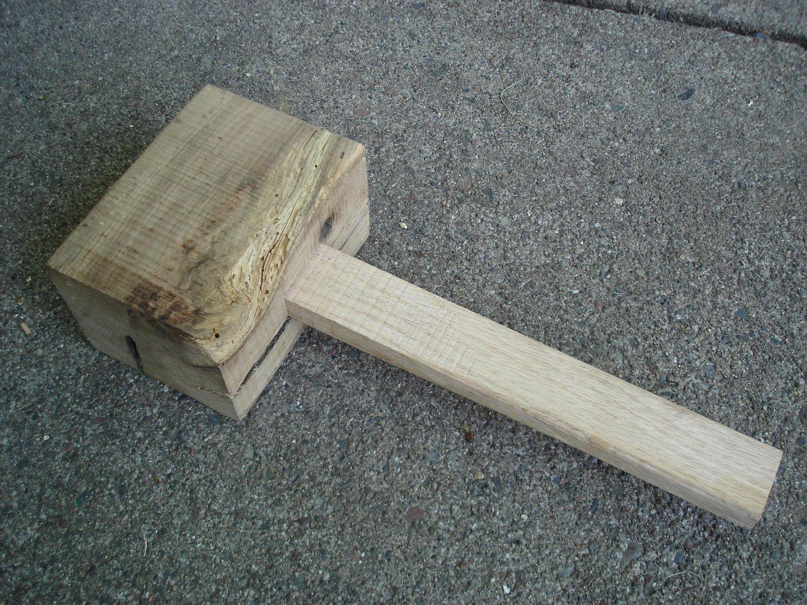

 

Last winter, a very generous friend of a friend let us haul away a truckload of old oak timbers.

The timbers came in a few lengths all over 1m and with varying conditions at the ends. Some had fancy looking old joinery that was still viable and some were decomposed.

A little TLC revealed lots of very usable oak. These will be the legs of my new workbench.

I cobbled together a new mallet from the scraps in anticipation of the joinery that will be required to finish the workbench

 18 
  <!---
  

      
    

            

                            

        

 
 

Last winter, a very generous friend of a friend let us haul away a truckload of old oak timbers.

 

  

 

The timbers came in a few lengths all over 1m and with varying conditions at the ends. Some had fancy looking old joinery that was still viable and some were decomposed.

 

  

 

A little TLC revealed lots of very usable oak. These will be the legs of my new workbench.

 

  

 

I cobbled together a new mallet from the scraps in anticipation of the joinery that will be required to finish the workbench

 

  
 18
  --->