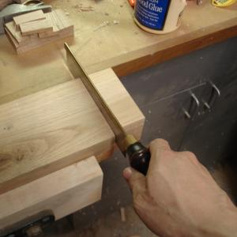
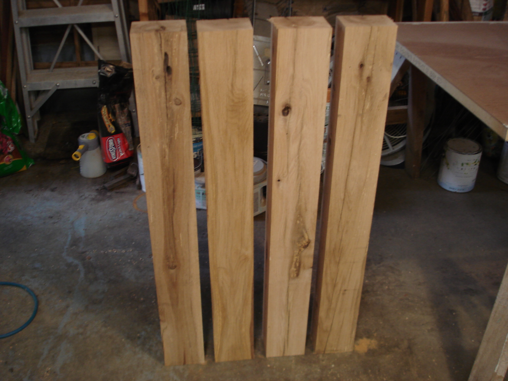
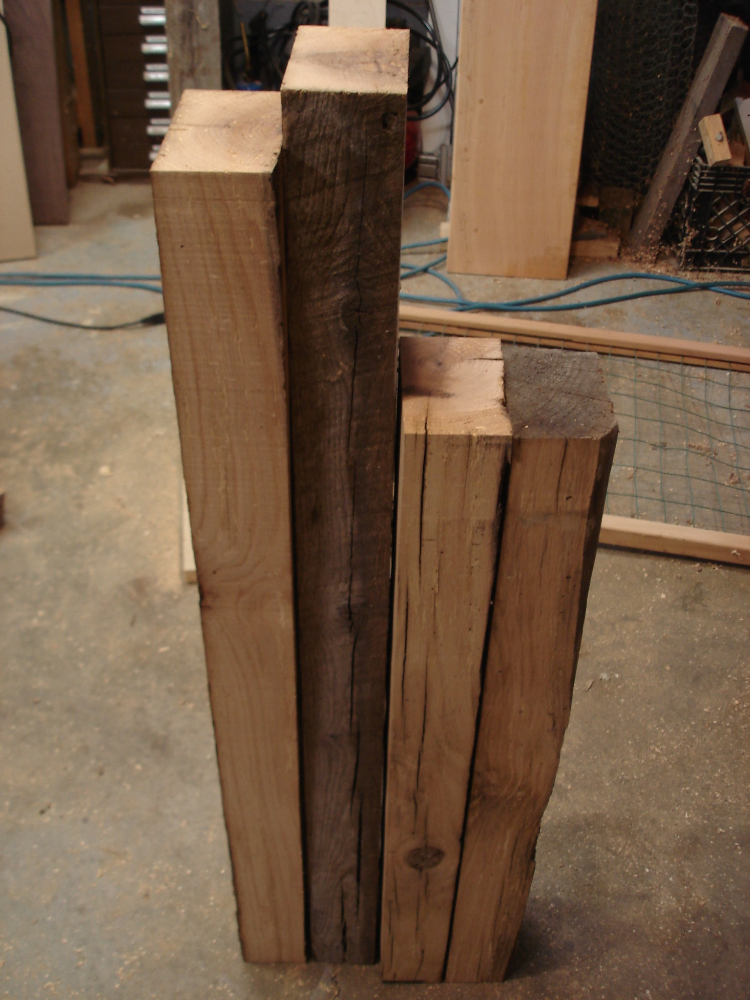
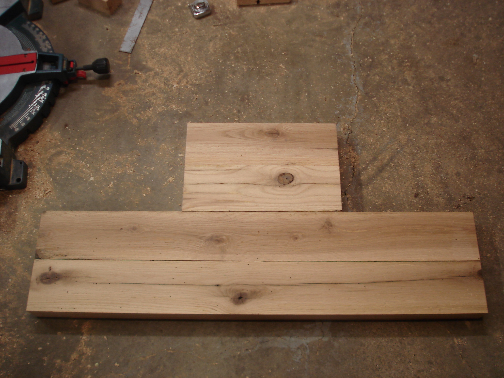
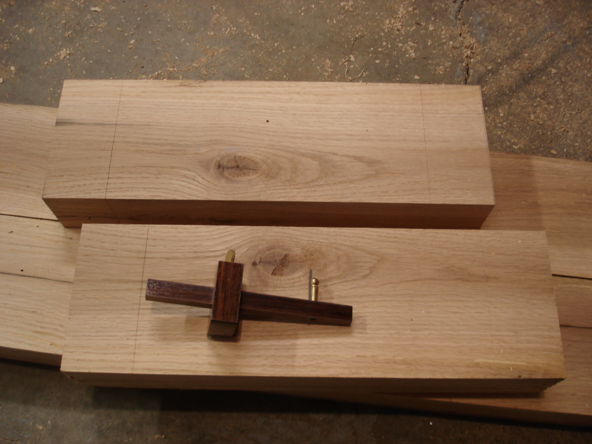

 

The legs are dimensioned and cut to length.

The last beam becomes the braces between the legs -- two long and two short.

Braces ready to join.

Tenons marked.

And the first tenons are roughed in.

 22 
  <!---
  

      
    

            

                            

        

 
 
The legs are dimensioned and cut to length.
 
  

 
The last beam becomes the braces between the legs -- two long and two short.
 
  

 
Braces ready to join.
 
  

 
Tenons marked.
 
  

 
And the first tenons are roughed in.
 
  
 22
  --->