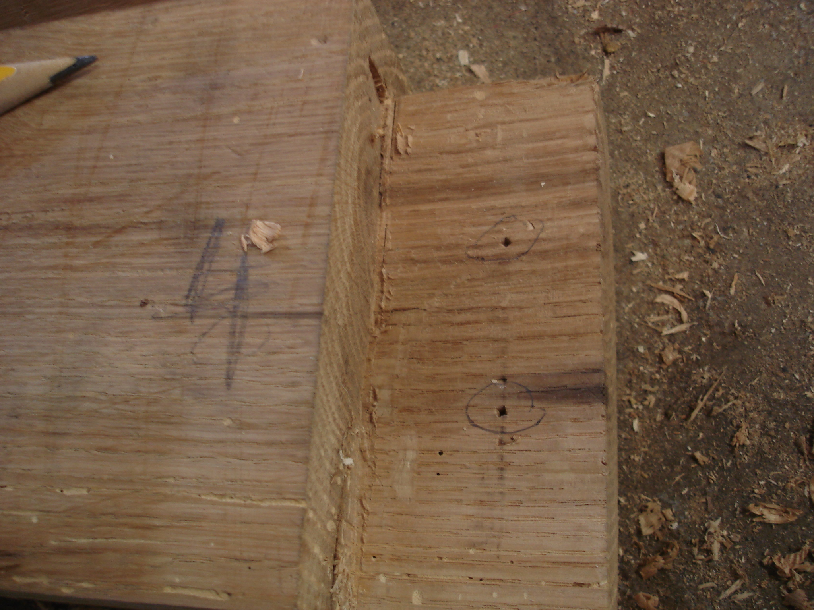

 

Tenons are cut to slide on the top. To drawbore the leg braces, I drilled the mortises through, inserted the tenons, tapped the same brad point bit to mark the tenons and then drilled the tenons 1/16" tighter than the mortise holes.   6 
  <!---
  

      
    

            

                            

        

 
Tenons are cut to slide on the top. To drawbore the leg braces, I drilled the mortises through, inserted the tenons, tapped the same brad point bit to mark the tenons and then drilled the tenons 1/16" tighter than the mortise holes.

  

  
 6
  --->