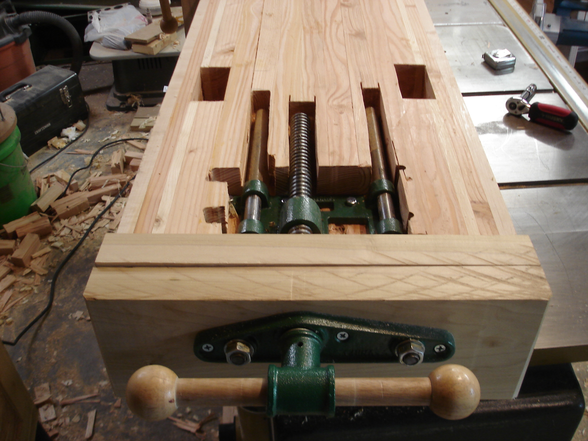
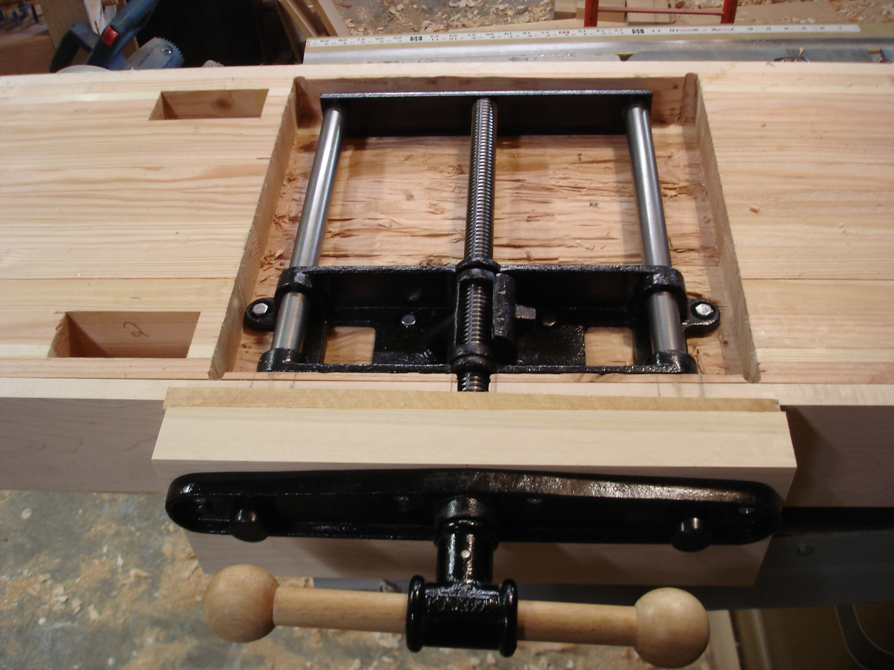
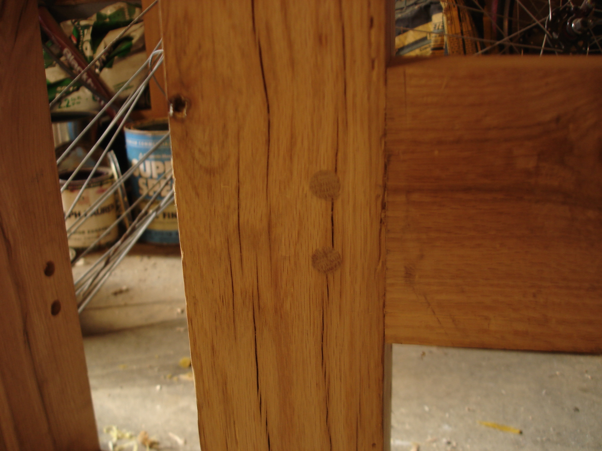

 

The top! Cheap construction lumber laminated with hard maple sides. Crosscutting the 5.25" top square proved a bit of a challenge. I made a rough cut with the handsaw but decided to screw on the mitre strip as shown for four runs through the table saw - top and bottom for each end. The end grain cleaned up nicely with a low angle block plane.

Installing the vises took most of a Saturday with router, circular saw and chisels.

The drawbored base pieces were a concern since I haven't used that type of joint before. But it went very smoothly and brought the braces tight to the legs.

 18 
  <!---
  

      
    

            

                            

        

 
 
The top! Cheap construction lumber laminated with hard maple sides. Crosscutting the 5.25" top square proved a bit of a challenge. I made a rough cut with the handsaw but decided to screw on the mitre strip as shown for four runs through the table saw - top and bottom for each end. The end grain cleaned up nicely with a low angle block plane.
 

  

 
Installing the vises took most of a Saturday with router, circular saw and chisels.
 

  

 

 

  

 
The drawbored base pieces were a concern since I haven't used that type of joint before. But it went very smoothly and brought the braces tight to the legs.
 

  
 18
  --->