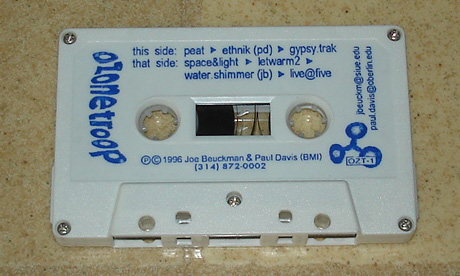

Paul B Davis and I had a techno group in St. Louis in the mid-90's called Ozone Troop. We had several gigs at local raves and nightclubs and coffee shops and performed at CMJ one year. We had several hand-labeled tapes for sale at Deep Grooves and participated in Moby's open remix competition for remixing the song "Every Time You Touch Me".

This was our most formal release as Ozone Troop:

This was one of our best tracks, ambient4p

<audio src="ambient-4p.mp3" controls="controls" autobuffer="autobuffer" preload="auto" xmlns="http://www.w3.org/1999/xhtml"><source src="ambient-4p.mp3"></audio>

[download](ambient-4p.mp3)
