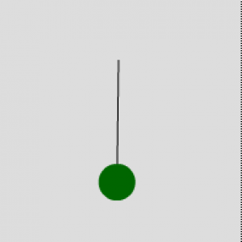

 

Sometimes it's nice to forget about 3rd party components, big clunky libraries, the Facebook API, etc. and just simulate a simple physical system from first principles. Here's "mass on a string":

Newton's 2nd law, amath\`vec F=m vec a\`endamath says that an object's acceleration is dependent on the force on that object. If you push something, its speed will increase in the direction of your push. And it takes harder pushing to move things with more mass as fast as it does little things.

When a mass is _pivoting_ instead of free to move (like a pendulum), the analogy of _force_ is _torque_, which is represented by the greek amath\`tau\`endamath. Torque is the force _along the pivot path_ multiplied by the distance from the force to the pivot point (the radius). amath\`tau = F\_tan \* r\`endamath.

amath\`tau\`endamath is like amath\`vec F\`endamath

Mass is a measure of how difficult it is to accelerate an object. The amount you have to push a pivoting body depends on the distance from the pivot to where you are pushing (think of opening a door by pushing on the handle vs. pushing right next to the hinge.) So in the pivoting case, the analogy for "mass" appears in the equation as the moment of inertia, which depends on plain old mass and how far the mass is from the pivot (radius) : amath\`I = m \* r^2\`endamath.

amath\`I\`endamath is like amath\`m\`endamath

When pivoting, we keep track of position by noting the angle, call it amath\`theta\`endamath. Then the velocity is the change in angle during each second, call it amath\`omega\`endamath. Finally, the acceleration is the change in angular velocity each second, call it amath\`alpha\`endamath.

amath\`alpha\`endamath is like amath\`vec a\`endamath

So for the pendulum, Newton's second law is like amath\`tau = I alpha\`endamath.

Let's look at the terms involved.

The force for a pendulum is supplied by gravity and has magnitude amath\`m\*g\`endamath where amath\`m\`endamath is the mass of the pendulum and amath\`g\`endamath is how hard the earth pulls on stuff. The tricky part about a pendulum is that this force is always changing direction when the pendulum swings, and we need to know how much of this force is _along the swing path_ of the pendulum.

Let's call the position angle of the pendulum _zero_ when the pendulum is hanging straight down. When at angle zero, the earth is pulling the string straight down and none of the weight force is in the direction of swing. Then when the pendulum is straight out at 90 degrees, _all_ of the force is against the swing path. To find the force along the path, we need to multiply the force by a changing number that is 0% at zero degrees, -100% at 90 degrees and some appropriate in-between number at every angle between zero and 90. The negative of the trigonometric function _sinus_ does this perfectly. The force along the swing path of a pendulum is amath\`m\*g\*-sin theta\`endamath.

Now we can expand amath\`tau = I alpha\`endamath into terms that we can easily supply:

amath\`m\*g\*-sin theta \* r = m \* r^2 \* alpha\`endamath

This is more than what we need to describe the motion of the pendulum. We can divide both sides by amath\`r^2\`endamath and by amath\`m\`endamath so this is more simply amath\`alpha = -g/r \* sin theta\`endamath. The term amath\`-g/r\`endamath is a constant that we can tune to make the program simulate a good-looking pendulum. To draw a pendulum on the screen, we must know its position, amath\`theta\`endamath. That means we can do a simple multiplication to find out how the angle-change rate is changing.

To program this, keep variables for **theta**\=amath\`theta\`endamath, which is the current angle of the pendulum, **omega**\=amath\`omega\`endamath, which is how the position is changing and **alpha**\=amath\`alpha\`endamath, which is how **omega** is changing. Each frame (or interval/timer event if you're into that kind of thing), multiply your tuned constant by minus sinus of the current **theta** to calculate the new **alpha**. Add that new **alpha** to **omega** and add **omega** to **theta**. Then rotate the pendulum graphic to the new value of **theta**. Schwing!

(click to increase **omega**)

swfobject.embedSWF("http://www.beigerecords.com/joe/sites/default/files/pendulum1.swf", "pendulum", "200", "200", "10.0.0");

[as3 demo source](undefined)

