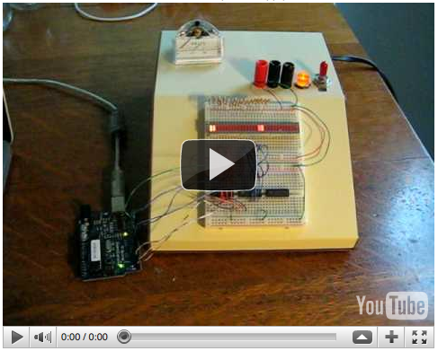

I should have built this 20 years ago. Slanty enclosure is from [Gateway Electronics](http://www.gatewaycatalog.com/) . Switching 5 & +/-12v power supply for now and plenty of space for switches/indicators and I-O recepticles. The voltmeter sitting on top is from [ABC Electronics](http://www.abcelectronicsmn.com/) and will be installed with a 0-30v LM317 based variable power supply.

<embed src="http://www.youtube.com/v/QGcm09bDVmI&amp;hl=en_US&amp;fs=1&amp;" type="application/x-shockwave-flash" allowscriptaccess="always" allowfullscreen="true" width="480" height="385">
