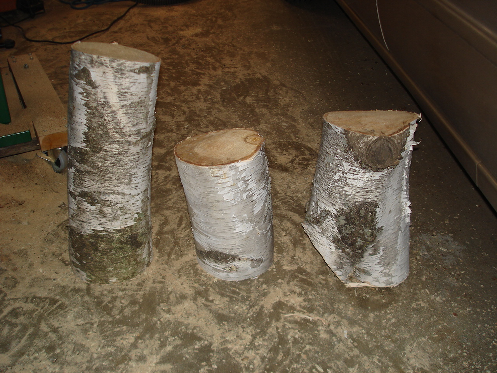
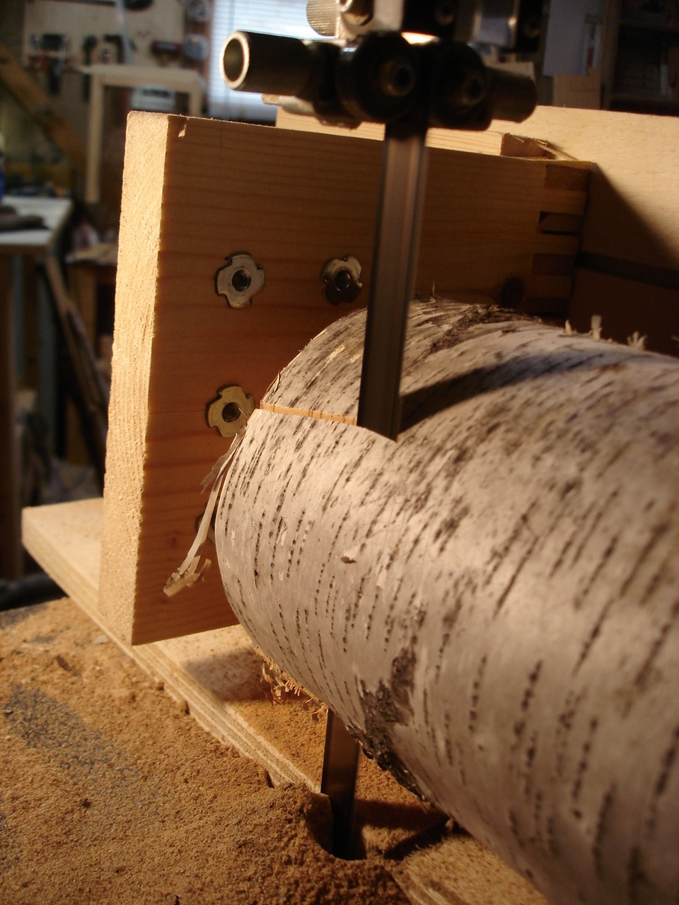
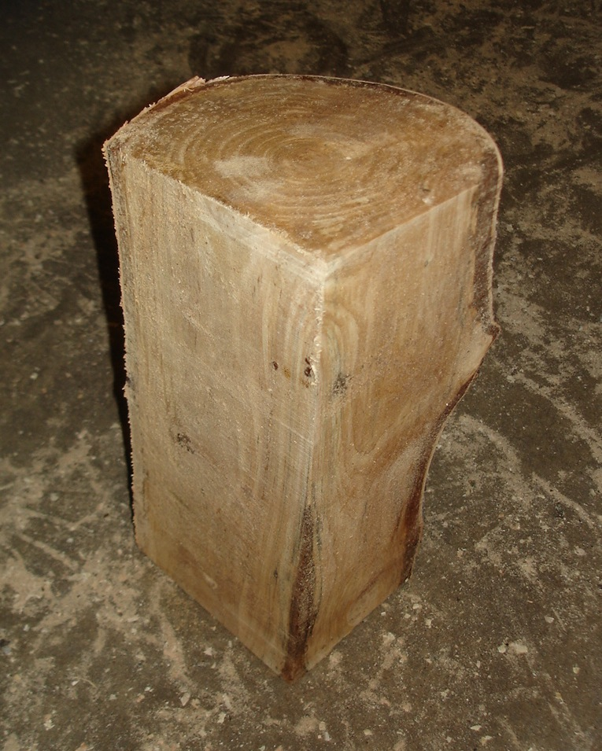
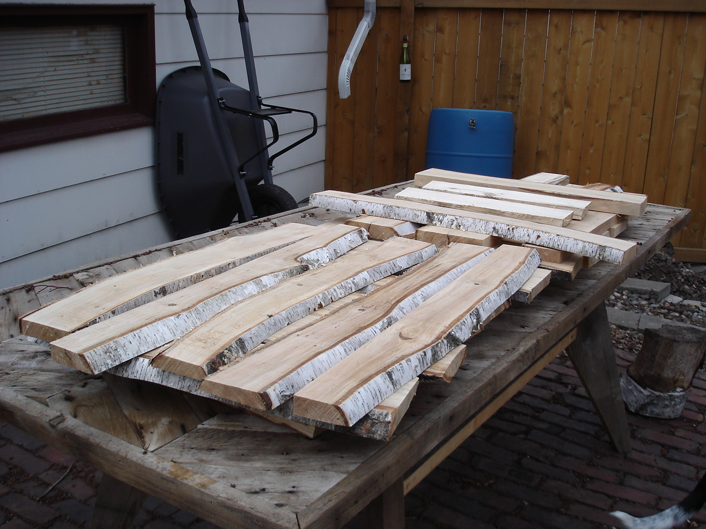
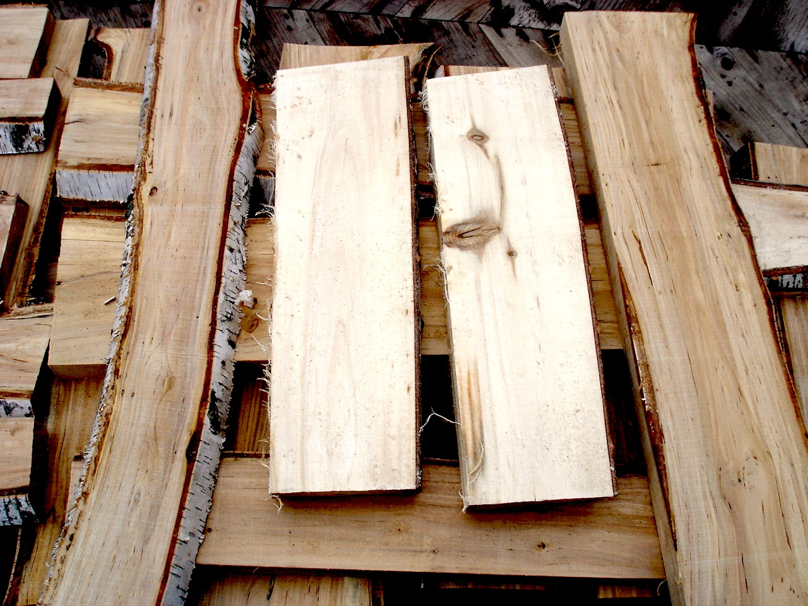

I finally got around to building a log sled - one of the main reasons for having a bandsaw. 

 

The body of the sled is 3/4" plywood with a few t-tracks routed in to allow the fence and clamps to be easily adjusted. I ground the holder bolts to a point and they hold large logs steady after a few turns into the green wood. A strip of oak glued onto the bottom rides easily in the mitre gauge slot on the bandsaw table. 

 

 

 

 

          