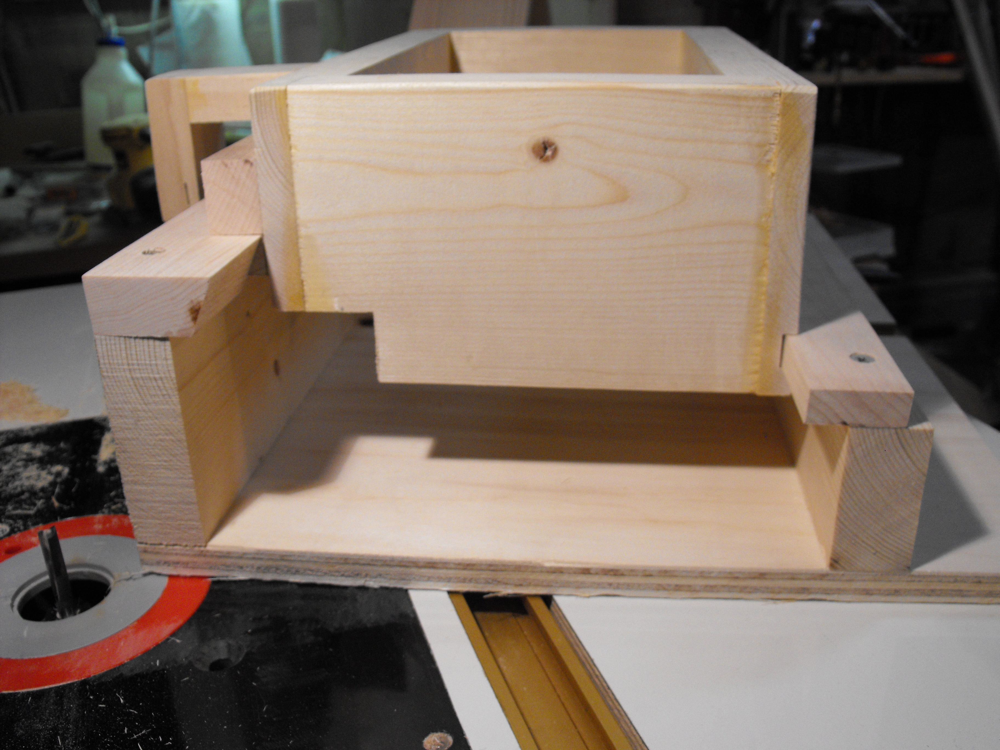
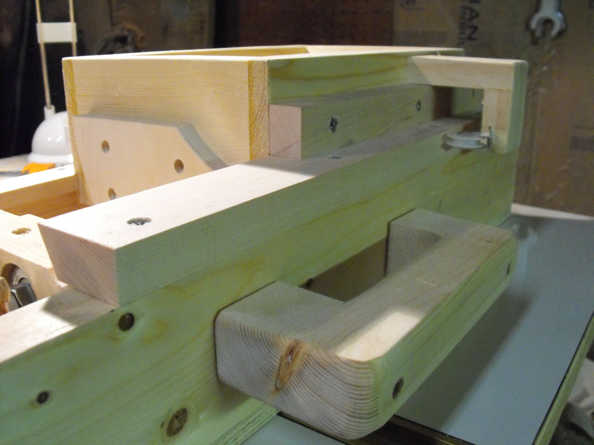
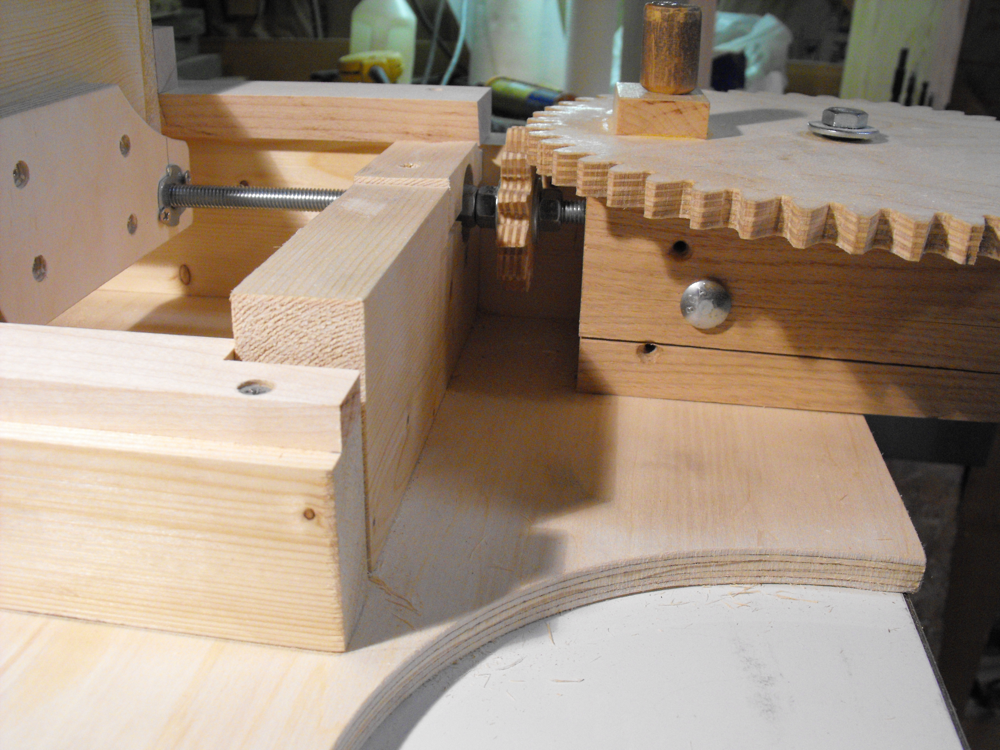

I copied the design for this box joint jig from the great [http://woodgears.ca/](http://woodgears.ca/). 

 

The carriage and rails use maple for the sliding parts. No oil necessary. 

 

I tried a few joints before building the spring-wheel assembly, which is itself box-jointed. My carriage only had a little play with no spring but I decided the spring is necessary to keep things aligned. 

 

This is the first gear-drive I've tried to make and turned out to work pretty well. 

<embed src="http://www.youtube.com/v/BKYGnkroXPQ?fs=1&amp;hl=en_US" type="application/x-shockwave-flash" allowscriptaccess="always" allowfullscreen="true" width="640" height="385">

 