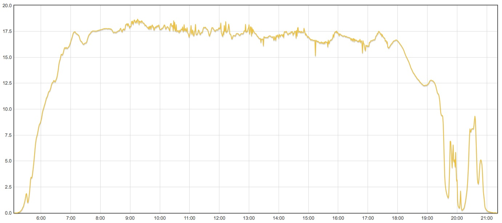

A recent hobby has been to build and install a solar panel on our roof. It's comprised of 36 common Evergreen Solar 3"x6" 1.8W cells in a simple wooden frame with a sheet of acrylic to protect them. My Dad helped run conduit and wires last weekend and the open source hardware/software available these days makes it unbelievably easy to setup a voltage logging apparatus. A 10k then a 2.2k resistor straddle the wires coming into our basement from the panel. The junction of those is connected to an analog input on an [Arduino Mini](http://www.arduino.cc/en/Main/ArduinoBoardMini) . Every minute, the Atmega reports the value read at that input to the serial port. A simple processing sketch receives the value and makes an HTTP request to my web host, which stores the value in a database. [The "Flot" plugin for jQuery](http://code.google.com/p/flot/) makes rendering a nice line-graph of the incoming data straightforward. 

