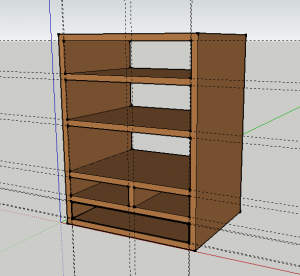

Some great christmas presents need a home close to my electronics bench in the laundry room. I justified my bandsaw and planer purchases by reasoning that I would be able to build useful things from cheap pine lumber. This shelf verifies the possibility.

google sketchup design:

 

finished and two coats of varnish: 
  
