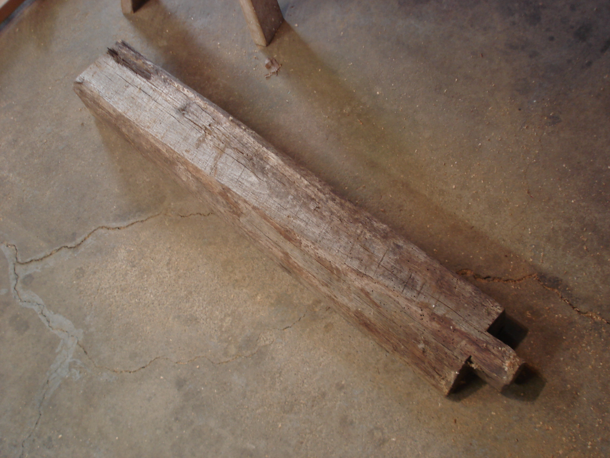
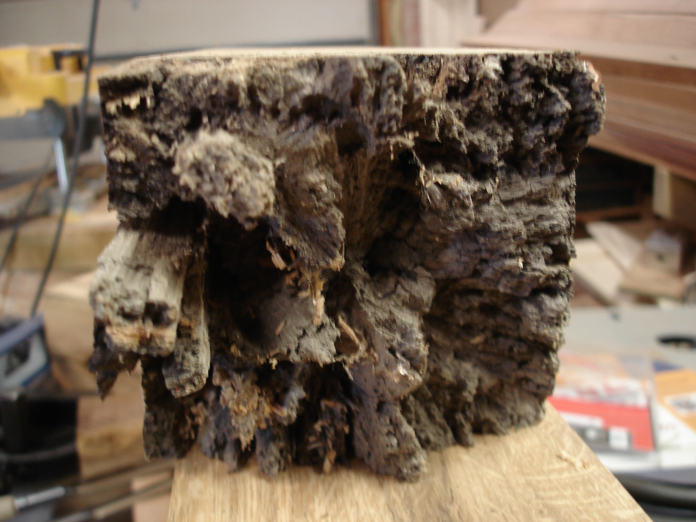
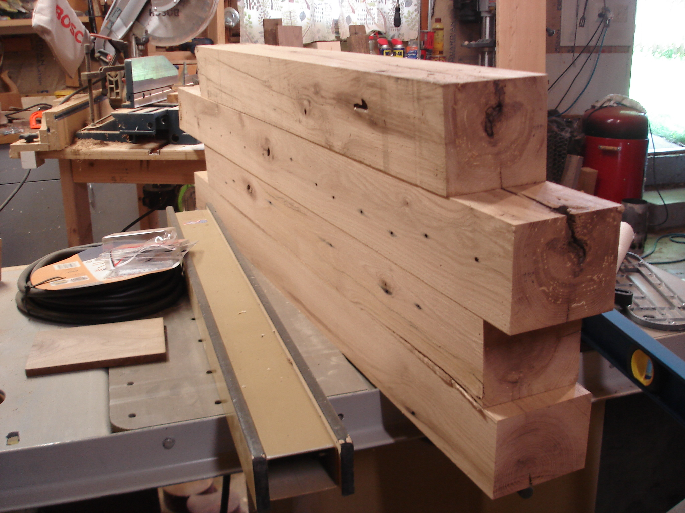
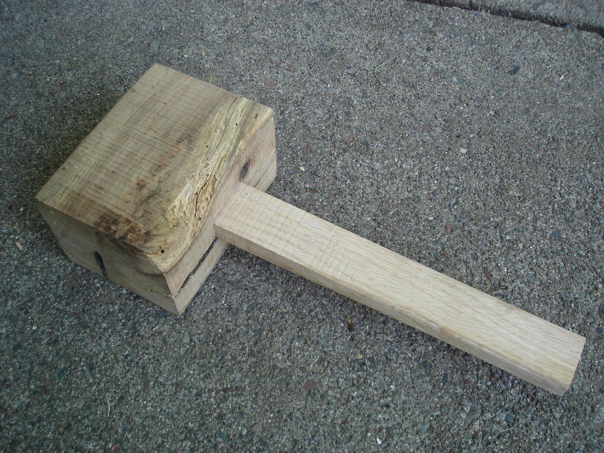

Last winter, a very generous friend of a friend let us haul away a truckload of old oak timbers.

The timbers came in a few lengths all over 1m and with varying conditions at the ends. Some had fancy looking old joinery that was still viable and some were decomposed.

A little TLC revealed lots of very usable oak. These will be the legs of my new workbench.

I cobbled together a new mallet from the scraps in anticipation of the joinery that will be required to finish the workbench

 