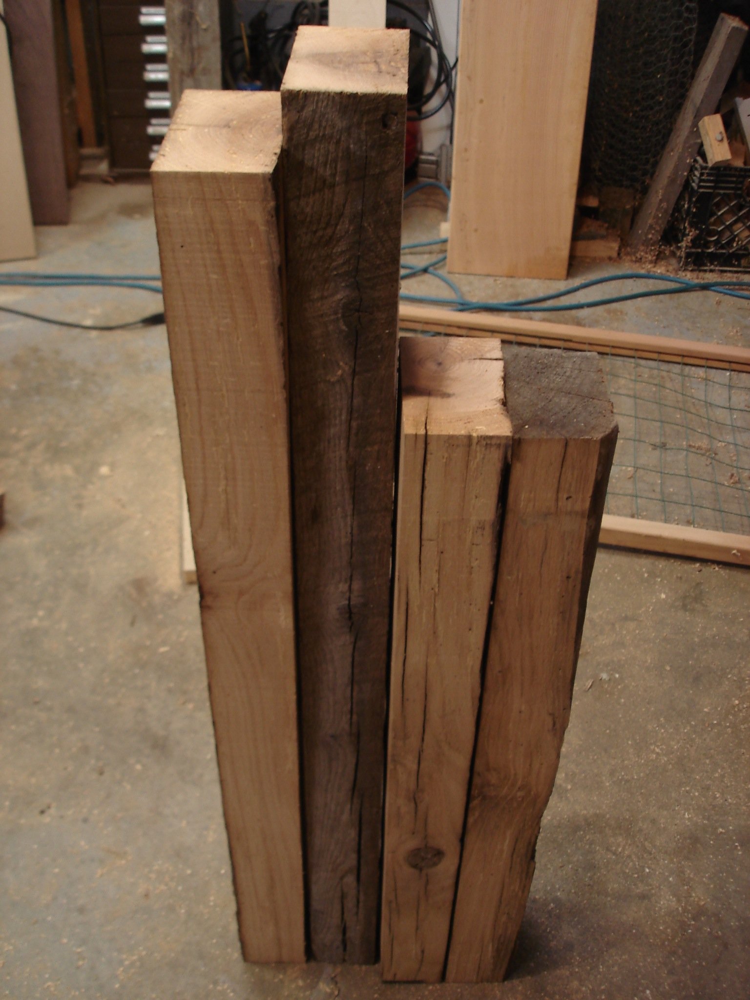
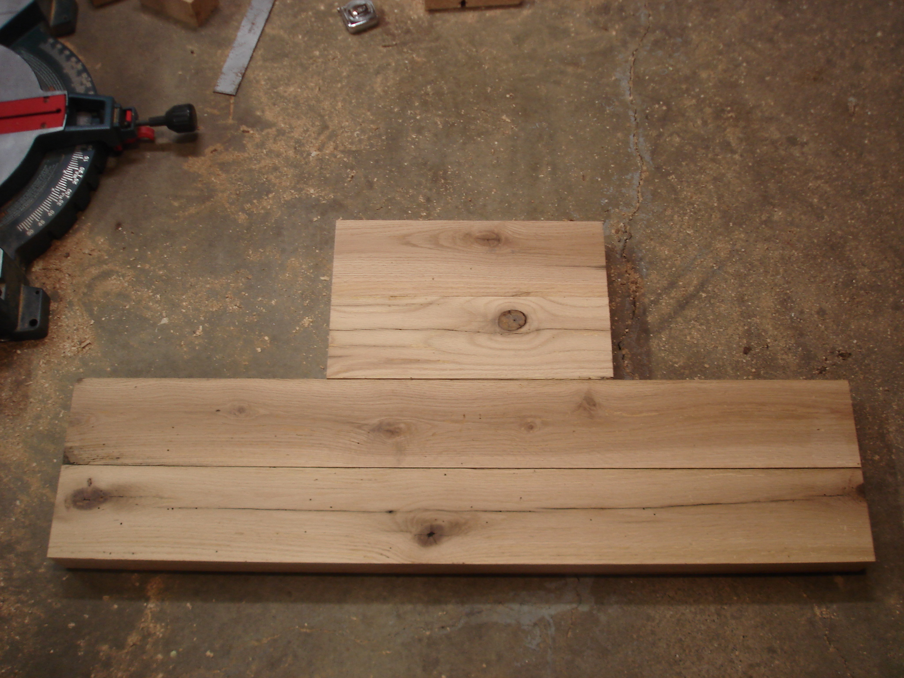

 

The legs are dimensioned and cut to length.

The last beam becomes the braces between the legs -- two long and two short.

Braces ready to join.

Tenons marked.

And the first tenons are roughed in.

 