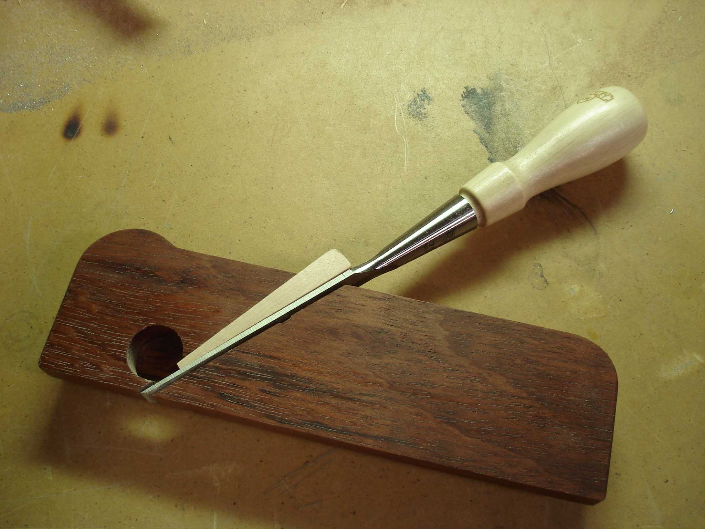
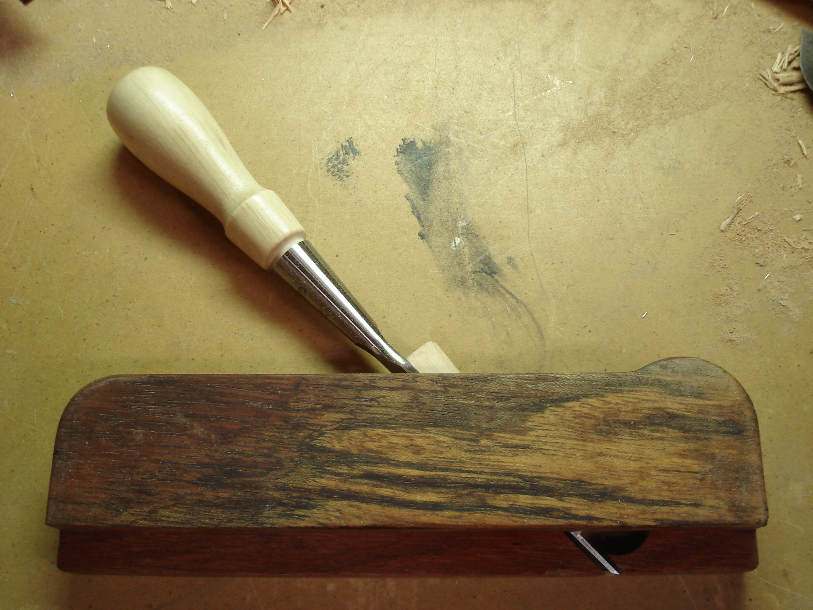
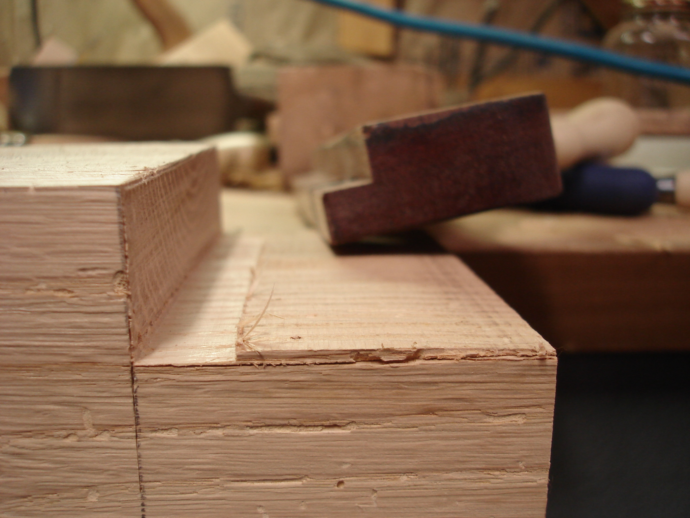
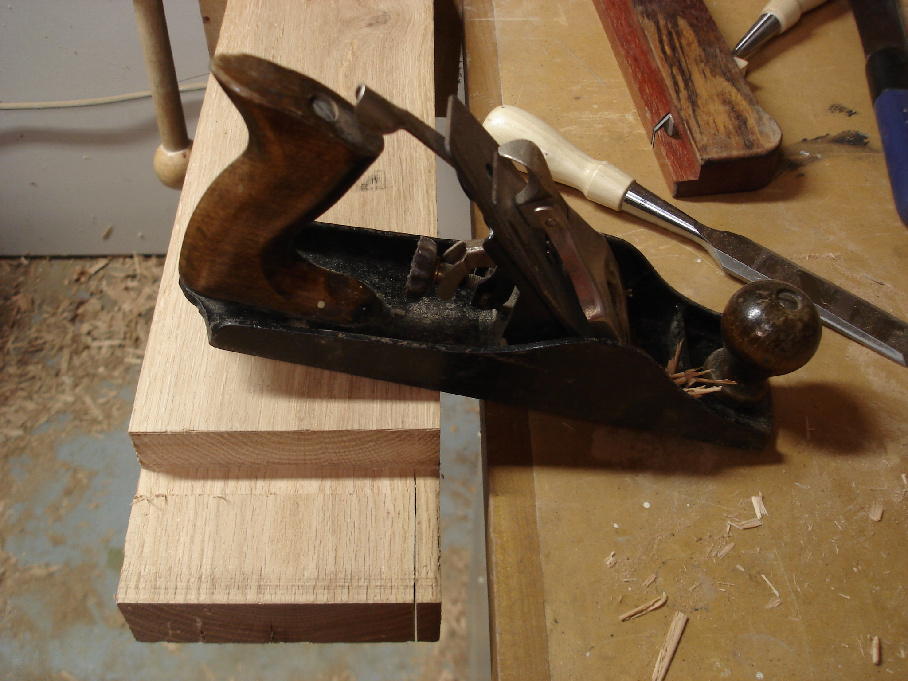

The most satisfying thing a monkey can do is use his own handmade tools. And, I spent a lot of time cleaning up the first seven tenons with just a chisel. So, I made this new shoulder/chisel plane after reading about [the one on garagewoodworks.com](http://garagewoodworks.com/garage_blog/2010/11/29/chisel-plane-2-0/).

It was faster to cnc my bed and then route the opposing rabbet than it would have been to glue a separate piece on the side. I randomly drew a hump on the top front of the plane which reminds me to steady the plane there while I push from the back. If I don't hold the front, the plane doesn't stay level or work very well. But it's very clean and effective when used carefully.

Here, I'm taking the cheek down to the marking knife line. This was the bottom of the bandsaw's kerf - pretty far from the line. It wandered partly because of traveling through 120mm of 100-plus-year-old oak or partly because I sharpen the bandsaw blade unevenly with my right hand. I'm happy that it didn't wander the other way.

Then, a few swipes with this old smoothing plane will bring the whole cheek to width. This is the last tenon in the workbench base!

 