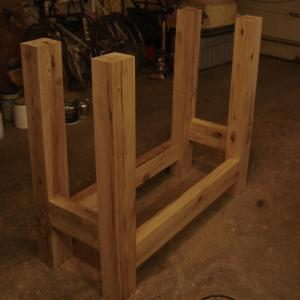

 

It's exciting to fit the base joints. I've been planning how to build the top, which will slide onto tenons cut into the tops of the legs. It will probably be the common setup with front vise and tail vise, just reversed so that it will fit into the place in the basement directly to the left of the fridge. I prefer the tail vise designs that use wooden guides and an inexpensive bench screw to the fancier and much more expensive steel rail setups. 